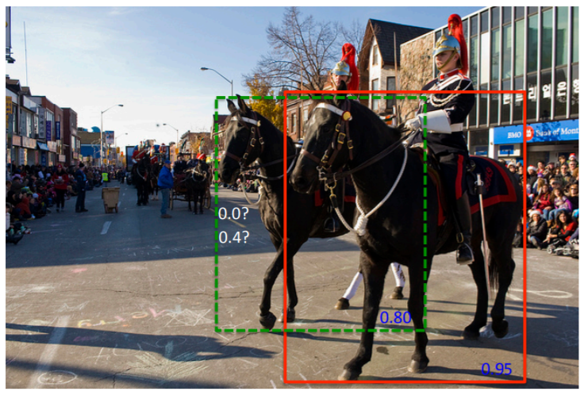
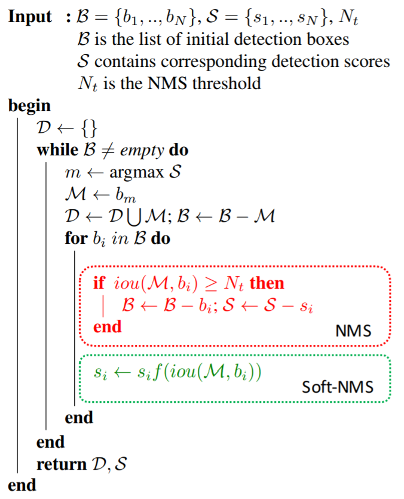
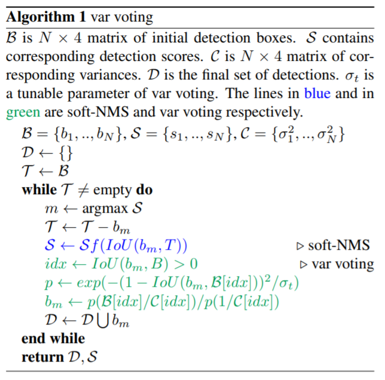

目标检测算法包含了三个要素：Backbone + Head + Postprocess，对于Postprocess部分，最早用的是NMS，后面出现了Soft NMS和Softer NMS，本文将分别解释它们的动机和原理。

## NMS

NMS，它的全称为“non-maximum supression”，中文名“非极大值抑制”。为什么要使用NMS呢？因为在目标检测任务中，不管是one-stage还是two-stage的算法，最终算法都会预测出多个proposals。在后处理部分中，需要对这些proposals做筛选。

### 动机

+ 优先选择分类score较高的proposal；
+ 跟分类score重叠较多的proposals，可以视为冗余的预测框；

### 步骤

1. 将算法预测出的所有proposals，按照不同的类别标签分组；
2. 对于每一个类别的所有proposals，记作$B$，筛选后的proposals集合记作$D$，执行如下操作，
	+ a. 选择score最高的proposal，记作$M$，加入到$M$中；
	+ b. 计算剩余的proposals与$M$之间的[IoU](/post/what-is-iou)，若大于阈值$N_t$ ，则舍弃，否则保留；
	+ c. 若步骤b中得到的所有proposals为空，则跳回步骤b，否则执行步骤a。
3. 经过后处理之后，所有类别保留的有效proposals集合为 $S=\{D_1, D_2, …, D_c\}$ ，其中$c$表示目标类别的数量；

##### 伪代码

## Soft-NMS

### 动机

由上可见，NMS算法保留score最高的预测框，并将与当前预测框重叠较多的proposals视作冗余，显然，在实际的检测任务中，这种思路有明显的缺点，比如对于稠密物体检测，当同类的两个目标距离较近时，如果使用原生的NMS，就会导致其中一个目标不能被召回，为了提高这种情况下目标检测的召回率，Soft-NMS应运而生。对于Faster-RCNN在MS-COCO数据集上的结果，将NMS改成Soft-NMS，mAP提升了1.1%。

### 算法思想

Soft-NMS，原文的标题为[“Improving Object Detection With One Line of Code”](https://arxiv.org/pdf/1704.04503.pdf)。NMS采用“一刀切”的思想，将重叠较多的proposals全部视作冗余，而Soft-NMS，采用了“迂回”战术，它认为重叠较多的proposals也有可能包含有效目标，只不过重叠区域越大可能性越小。参见下图，NMS会将绿色框的score置0，而Soft-NMS会将绿色框的score由0.8下降到0.4，显然Soft-NMS更加合理。

那么问题来了，怎么建立IoU和score之间的联系呢，文章中给出的公式如下:

$$
s_i = s_i e^{-\frac{\text{iou}(M, b_i)^2}{\sigma}}, \forall b_i \notin D
$$

其中$D$表示所有保留的有效框集合, $b_i$表示待过滤的第$i$个预测框，$s_i$为第$i$个预测框对应的分类score。这里使用了高斯函数作为惩罚项，当$iou=0$时，分类score不变，当$0<iou<1$时，分类score会做衰减。以上图为例，绿色框$b_i$和红色框$M$的iou大于0，经过Soft-NMS后该绿色框的分类score由0.8衰减到0.4，可以推断出，如果图中有第2个绿色框，且其与红色框的重叠区域更大时，那么这个新的绿色框的分类score可能由0.8衰减到0.01。

### 步骤

#### 伪代码

## Softer-NMS

### 动机

#### 现有方法的问题

作者使用VGG-16 faster R-CNN测试了MS-COCO数据集中的图片，论文中贴了两张检测失败的代表图片，如下图

**左图存在的问题：**检测出来的2个proposals，沿着y坐标轴方向的定位均不准确；

**结论：**检测算法预测出来的proposals的坐标不一定准确；

**右图存在的问题：**检测出来的2个proposals，右边的框分类score较高，但是却沿着x坐标轴方向的定位不准确；

**结论：**分类score高不一定定位score高，也即classification confidence和 localization confidence不具有一致性。

#### 本文解决方法

针对上面的问题，
1. 既然proposals的坐标不准确，那么即便NMS也无能为力了，所以需要重新设计坐标回归的方式)；
2. 既然分类score高不一定定位score高，那么NMS和Soft-NMS的做法（只基于分类score对proposals做排序）是不准确的，所以需要同时预测出检测框的定位score。

### 算法

Softer-NMS的算法框架如下图，可以看出，它跟fast R-CNN是非常相似的，区别在于回归任务中多了一个Box std分支，这里需要解释一下，比如预测出的bounding box的坐标为$x_1, y_1, x_2, y_2$，该分支会预测出每个坐标的标准差，显然，当坐标的标准差越小时，表明预测得到的坐标值越可信，也即Box std分支用于表征定位任务的置信度。





#### 定位任务

在fast R-CNN中，作者使用的是均方误差函数作为定位损失，总的目的是让定位出的坐标点尽可能逼近groundtruth box。本文中为了在定位坐标同时输出定位score，使用了高斯函数建模坐标点的位置分布，公式如下，

$$
P_\Theta(x) = \frac1{2\pi \sigma^2} e^{-\frac{(x-x_e)^2}{2\sigma^2}}
$$

其中，$x_e$为预测的box位置，$\sigma$表示box位置的标准差，衡量了box位置的不确定性。因为groundtruth位置是确定的，所以groundtruth box的坐标为标准差为0的高斯分布，也即Dirac delta函数，公式如下，

$$
P_D(x) = \delta (x-x_g)
$$

其中，$x_g$ 为groundtruth box的坐标。

#### 定位损失

回归任务的目的是让预测框尽可能逼近真实框，也即$P_\theta(x)$和$P_D(x)$为同一分布，衡量概率分布的相似性，自然而然会想到KL散度，关于KL散度的概念，大家可以参见维基百科，值得一提的是，KL散度本身具有不对称性，通常，在实际应用中为了使用对称性，使用的是KL散度的变形形式，但本文中没有这么做。对公式做化简后，最终的简化形式如下，

$$
L_{reg} = \alpha \left( \left( x_g - x_e \right) - \frac12 \right) - \frac12 \log \left( \alpha + \epsilon \right)
$$

#### 后处理

经过上面的网络部分，Class分支会输出类别score，Box分支会输出box的4个坐标和这4个坐标对应的标准差（定位score），符号表示如下，

$$
\\{ x1\_i, y1\_i, x2\_i, y2\_i, s\_i, \\sigma\_{x1, i}, \\sigma\_{y1, i}, \\sigma\_{x2, i}, \\sigma\_{y2, i} \\}
$$

基于这些信息，新的后处理算法如下图，

显然，softer-NMS基于回归出的定位confidence，对所有与$M$的IoU超过阈值$N_t$的proposals，使用加权平均更新其位置坐标，从而达到提高定位精度的目的。因为softer-NMS关注的是单个框的定位精度，而NMS和soft-NMS关注的是单个框的冗余性，显然关注点不同，所以softer-NMS可以和soft-NMS组合使用，此时效果更佳。

## 总结

**NMS：**只适用于图片中目标比较稀疏的场景，即目标之间的间距较大；

**soft-NMS：**可以部分解决出现稠密目标的情况；

**softer-NMS：**该后处理方法采用"bagging"的思想，通过后处理提高定位精度，可以和soft-NMS组合使用。

## 参考资料

[1] [目标检测后处理：从nms到softer nms](https://blog.csdn.net/diligent_321/article/details/85859462)

[2] [Improving Object Detection With One Line of Code](https://arxiv.org/pdf/1704.04503.pdf)

[3] [Bounding Box Regression with Uncertainty for Accurate Object Detection](https://arxiv.org/pdf/1809.08545.pdf)

