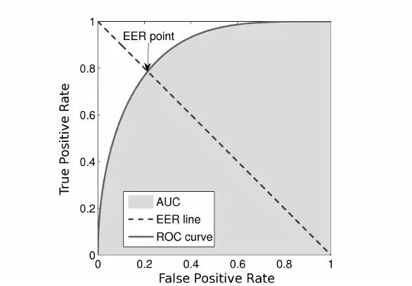
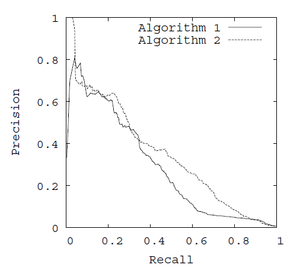

在分类模型的评价标准中，PR曲线和ROC曲线被广泛应用于模型的性能评估。本文对PR曲线和ROC曲线及其相关的性能指标AUC, EER进行介绍。

## 混淆矩阵 Confusion Matrix

<table align="center" style= "vertical-align: middle;">
    <tr>
        <td colspan="2" rowspan="2"></td>
        <td colspan="2">Truth</td>
        <td rowspan="2"> $\sum$ </td>
    </tr>
    <tr>
        <td>1</td>
        <td>0</td>
    </tr>
    <tr>
        <td rowspan="2"> Estimate </td>
        <td> 1</td>
        <td> TP </td>
        <td> FP </td>
        <td> TP+FP </td>
    </tr>
    <tr>
        <td> 0 </td>
        <td> FN </td>
        <td> FP </td>
        <td> FN+FP </td>
    </tr>
    <tr>
        <td colspan="2"> $\sum$ </td>
        <td> TP+FN </td>
        <td> FP+TN </td>
        <td> TP+TN+FP+FN </td>
    </tr>
</table>

+ 真正例 (True Positive, TP): 预测值和真实值都为1
+ 假正例 (False Positive, FP): 预测值为1，真实值都为0
+ 真反例 (True Negative, TN): 预测值和真实值都为0
+ 假反例 (False Negative, FN): 预测值为0，真实值都为1

由这四个指标衍生出的指标：

+ 查准率/准确率:                       $ \text{Precision} = \frac{TP}{TP+FP} $
+ 查全率/召回率:                       $\text{Recall} = \frac{TP}{TP+FN}$
+ 真阳率(True Positive Rate): $\text{TPR} = \frac{TP}{TP+FN}$
+ 假阳率(False Positive Rate): $\text{FPR} = \frac{FP}{FP+TN}$

## ROC曲线

### ROC定义

ROC曲线(Receiver Operating Characteristic Curve, 受试者工作特征曲线)是比较分类模型好坏的可视化工具。

以FPR为x轴，TPR为y轴绘制图。如下图所示。

在ROC曲线中又可衍生出EER, AUC两个指标。

+ EER(equal error rate): TPR=FPR时的值。
+ AUC(area under curve): ROC曲线下的面积

## PR曲线

PR曲线中P是Precision, R是Recall。

以Recall为x轴，Precision为y轴。

