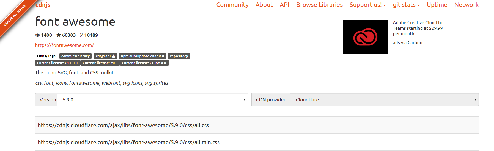
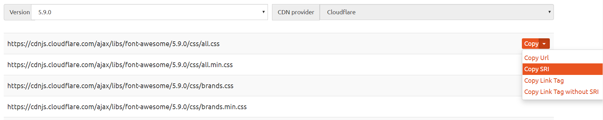

Academic主题可以使用[Font Awesome](https://fontawesome.com/icons?d=gallery)和[Academicons](https://jpswalsh.github.io/academicons/)的各种图标。但是Academic本身支持的版本不一定是最新的，部分图标因此不会显示。因此本文将介绍如何更换成最新的、速度更快的源。

## icon包简要介绍

icon包`fab`包括以下**品牌**图标：

- twitter，weixin，weibo，linkedin，github，facebook，pinterest，twitch，youtube，instagram，soundcloud
- [查看所有图标](https://fontawesome.com/icons?d=gallery&s=brands)

icon包`fas`和`far`包括以下**常规**图标：

- 传真，信封（电子邮件），评论（论坛）
- [查看所有图标](https://fontawesome.com/icons?d=gallery&s=regular,solid)

icon包`ai`包括以下**学术**图标：

- cv，google-scholar，arxiv，orcid，researchgate，mendeley
- [查看所有图标](https://jpswalsh.github.io/academicons/)

## 在Hugo-Academic中使用图标

以python图标为例，在[Font Awesome](https://fontawesome.com/icons?d=gallery&q=python)中找到python的编号为“fab fa-python"。

### 在skills面板中使用图标：

`/content/home/skills.md`

```toml
[[feature]]
	icon="python"
	icon_pack="fab"
	name="Python"
	description="80%"
```

### 在about面板中使用图标：

`/content/authors/<author-name>/_index.md`

```toml
social:
- icon: python
  icon_pack: fab
  link: "..."
```

{}

注意: `icon`的值不是完整的编号，要去除`fa-`前缀。

{}

## 更换Hugo-Academic主题使用的Font Awesome源

我们将使用Font Awesome的最新版本5.9.0(截至至2019年7月10日)来代替Academic默认使用的5.6.0版本。

我使用[cdnjs](https://cdnjs.com/libraries/font-awesome)提供的CDN源，点击[此处](https://cdnjs.com/libraries/font-awesome)查看当前最新版本。



分别复制url和sri。



修改到`themes/academic/data/assets.toml`中。

```toml
[css.fontAwesome]
  version = "5.9.0"
  sri = "sha256-PF6MatZtiJ8/c9O9HQ8uSUXr++R9KBYu4gbNG5511WE="
  url = "https://cdnjs.cloudflare.com/ajax/libs/font-awesome/%s/css/all.css"
```

更新完成。

