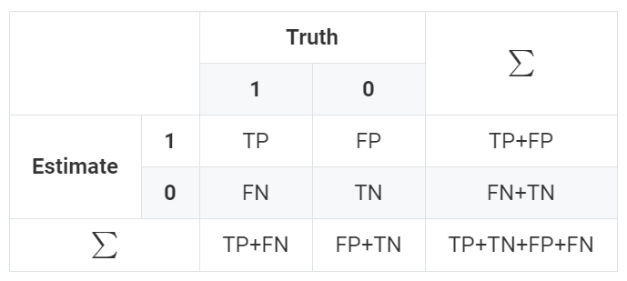

Hugo Academic主题自带的表格样式个人感觉不是特别美观，我更喜欢GitHub的表格样式，因此我花了点时间将Hugo Academic主题的表格样式改成GitHub的样式。

在hugo建立的根目录下创建目录`assets/css/`，再在新创建的目录下创建`custom.css`。

```shell
$ cd <your-hugo-website>
$ mkdir -p assets/css/
$ vi assets/css/custom.css
```

在`custom.css`中添加以下样式代码。

```css
table {
	display: block;
	overflow: auto;
	width: 100%;
}
table tr {
	background-color: #fff;
	border-top: 1px solid #c6cbd1;
}
table tr:nth-child(even) {
	background-color: #f6f8fa; 
}
table tr:nth-child(odd)  {
	background-color: #fff; 
}
table>tbody>tr:nth-child(odd)>td, table>tbody>tr:nth-child(odd)>th {
	background-color: #fff;
}
table>thead>tr>th, table>tbody>tr>th, table>tfoot>tr>th, table>thead>tr>td, table>tbody>tr>td, table>tfoot>tr>td {
    padding: 6px 13px;
}
table th {
	font-weight: 600;
}
table th, td  {
	vertical-align: middle !important;
	text-align: center;
	border: 1px solid #dfe2e5;
	padding: 6px 13px;
}
table img {
	background-color: transparent;
}
```

将`config/_default/params.toml`中的`plugins_css`设置为` ["custom"]`，即

```
plugins_css = ["custom"]
```

表格样式修改完成。

该表格样式会将内容水平和垂直居中，并且单双行不同色。

附带表格样式的效果图：



