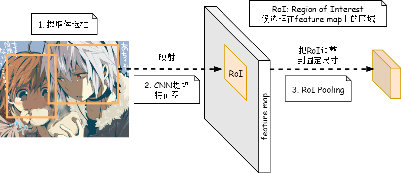
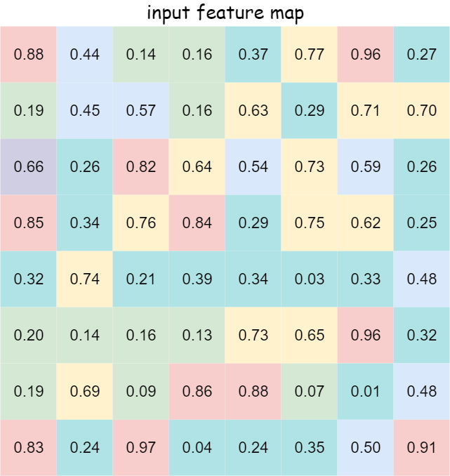

[上文](/post/what-is-roi/)讲了什么是RoI(Region of Interest, 感兴趣区域)，本文讲述RoI Pooling的概念。

### RoI Pooling 的作用

RoI Pooling是Pooling(池化)的一种，而且是针对RoI的池化。它的作用是**输入尺寸不固定的特征图，输出尺寸固定的特征图**。

### RoI Pooling 的输入

+ **特征图 feature map**：由原图像通过CNN计算得到的特征图
+ **感兴趣区域 RoI**: 许多候选框，形状为$1 \times 5 \times 1$ (4 个坐标[x,y,w,h] + 索引[index])

{}

**RoI的坐标的参考系是原图(CNN的输入)**，而不是feature map。

{}

### RoI Pooling 的输出

输出batch个张量，其中batch的值等于RoI的个数，张量大小为(channel, w, h)， w和h人为指定。RoI Pooling的过程就是将一个个尺寸不同的RoI都映射成大小固定的(w, h)的RoI。

## 图解 RoI Pooling

考虑一个 $8 \times 8$ 大小的feature map，一个RoI，以及输出大小为 $2 \times 2$.

1. **输入固定大小的feature map**
   
2. **region proposal 投影后的位置**
   
3. **将其划分为 $(2 \times 2)$ 个sections (因为输出大小为$2 \times 2$)**
   
4. **对每个section做max pooling，可以得到:**
   